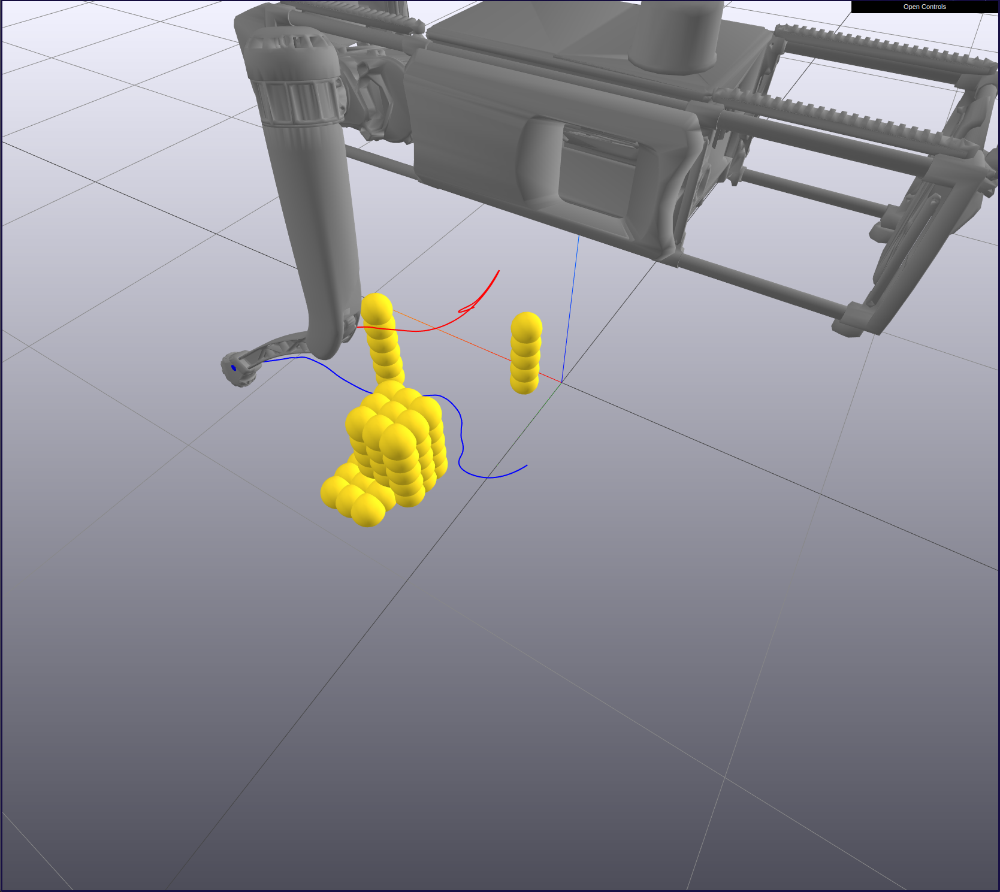

# Learned Swing Leg Trajectory Optimization

This work was originally a final project for myself and [@aukchen](https://github.com/aukchen) as part of Meam 517: Controls and Optimization for Robotics at Penn, taught by Professor Michael Posa.

Weights and Biases Report [here](https://wandb.ai/akulkarni/517_final/reports/Meam-517-Trial-Comparison--VmlldzozNjM0Mzc). 

This is an offline, nonlinear trajectory optimization that can output a collision-free spline (when possible) for a 3-DOF
quadrped leg, here using the Ghost Robotics Vision 60 as a model). We use the offline trajectory, which takes between
30-120 seconds to solve depending on the complexity of the obstacles to train a deep network that takes a heightmap as input
and outputs a similar trajectory. Specific emphasis was placed on being perception agnostic, and so our system takes in a 2D 
top down heightmap as the environment representation, and parameterizes large obstacles as a smaller discretization.

Full credit given to the Ghost Robotics Description repository [here](https://gitlab.com/ghostrobotics/ghost_description/). The drake friendly URDF and meshes for visualization where adapted from there. No control or perception software from Ghost Robotics is used in this work.

### Nonlinear Optimization

We formulate the trajectory optimization as a nonlinear direct collocation for the pyDrake SNoPT solver. We formulate constraints
for the kinematics, the toe start location, and the obstacles. The obstacle to leg link check specifically is done as a point to line 
with a certain threshold (so it ends up being more like a sphere to a cylinder with he obstacle and link radii). We also include an above ground constraint
as well as a small rate-limiting constraint to smooth out the output trajectory. Finally, there are bounding box constraints
on the joint angles, the joint velocities, and the input efforts.

The cost functions include some penalty on control effort, as well as a penalty on distance from a simple reference trajectory
that hits some apex height. We use a two stage solve process, first solving the full optimization on 15 knot points, and
then resolving the same problem with that original solution as input to do a sort of "feasibility" check and make sure
that any clipping of obstacles between knot points is remove (this happens with N=35). 

### Random Environment Generation

We generate random environments by creating N objects of dimension XxYxZ at some random location within the workspace of the leg.
These are randomly generated every time step and as part of our learned effort, we generated and solved >3000 different environments.

All of these environments start as discrete obstacles, but are then reparameterized into a heightmap. This is a critical 
part of making the pipeline perception agnostic and leaving the door open for plugging into a different up stream system.

### Learned Experiments

We conducted multiple learned experiments with our collected data, using multiple different network architectures and
output parameterizations. We attempted to learn the output control efforts, the output joint angles, as well as the xyz locations
of the toe during the output trajectory. We also trained a feasibility classifier as a sanity check to predict whether
or not there even was a feasible path through a given obstacle set. This was actually particularly meaningful, since with
our existing random obstacle generation parameters, approximately 30% of all generated data is infeasible.

### Troubleshooting
Can't get the zmq server to launch as a subprocess when running locally, so I start this 

`meshcat-server --zmq-url=tcp://127.0.0.1:6000 &`

all the constraints are in `constraints.py`

running `find_trajectory.py` solves the dircol and plots it in meshcat